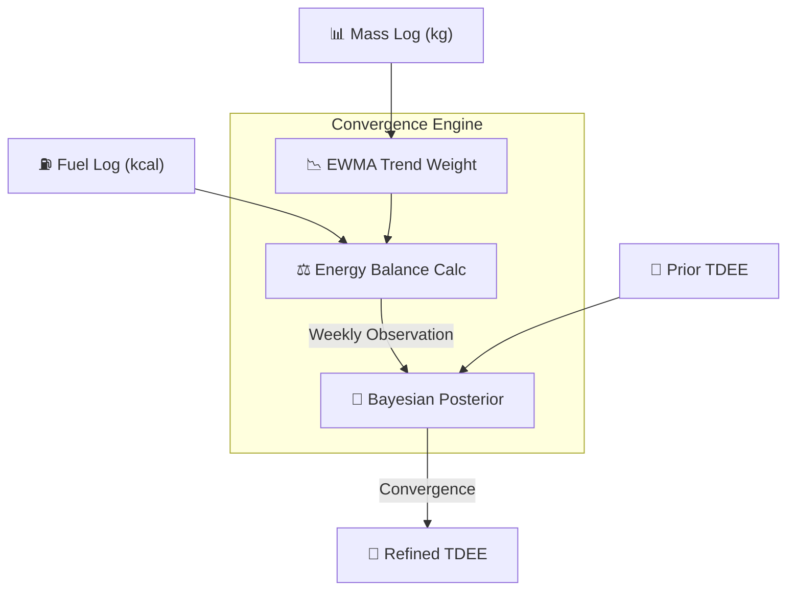

# Product Requirements Document: Dynamic Energy Tracker (Dense Matrix)

## Abstract
Dynamic Energy Tracker (codenamed **Dense Matrix**) is a high-precision metabolic tracking platform designed to provide users with an accurate, real-time estimation of their Total Daily Energy Expenditure (TDEE). Unlike traditional static calorie trackers, Dense Matrix employs a Bayesian convergence engine that adaptively refines a user's metabolic profile based on longitudinal mass and energy intake data. The system prioritizes tactical telemetry over gamification, offering an "interface as an instrument" for power users, athletes, and metabolic enthusiasts.

## 1. Product Vision & Mission
The mission of Dense Matrix is to eliminate the guesswork in nutritional planning by providing a mathematically rigorous estimation of human energy flux. The product follows the philosophy that **the interface is an instrument, not a dashboard.** Every UI element is designed to carry or frame data with clinical precision, utilizing a "Tactical Amber" and Obsidian aesthetic to signal a mission-critical environment.

### 1.1 Core Value Proposition
- **Dynamic TDEE Core**: Real-time Bayesian estimation that reacts to physiological changes.
- **Energy Flux Runway**: A predictive visualizer for daily energy balance.
- **Convergence Engine**: A weekly "metabolic audit" that bridges the gap between raw data and actionable targets.
- **Tactical Design**: A high-contrast, high-density UI optimized for expert utility.

## 2. Target User Personas
### 2.1 The Metabolic Enthusiast
- **Profile**: Highly data-driven, often tracks macros and weight daily.
- **Pain Point**: Frustrated by static calculators that don't account for metabolic adaptation or activity changes.
- **Goal**: Find their exact "maintenance" calories and adjust targets with 50-kcal precision.

### 2.2 The Tactical Athlete
- **Profile**: Focused on body composition and performance.
- **Pain Point**: Needs to balance aggressive training loads with precise weight management.
- **Goal**: Monitor the "noise floor" of their weight and ensure energy flux supports performance without unintended mass loss.

## 3. Functional Requirements

### 3.1 Bayesian Convergence Engine (BCE)
The core logic resides in the `packages/engine` package, implementing energy balance mechanics based on mixed-flux density research (6200 kcal/kg).

- **Weight Trending**: Exponentially Weighted Moving Average (EWMA) with a default alpha of 0.1 to filter scale noise.
- **Observation Window**: Weekly (Monday-to-Monday) audits.
- **Update Schedule**:
    - **High Trust (≥5 days of data)**: 60% weight to current week.
    - **Moderate Trust (3-4 days)**: 40% weight.
    - **Low Trust (<3 days)**: Skip update to preserve prior integrity.

### 3.2 Command Center (Mobile Dashboard)
- **Energy Flux Runway**: Real-time gauge of current intake vs. dynamic target.
- **Telemetry Grid**: High-density display of BMR, Active Calories, and Trend Weight.
- **Quick-Log Shelf**: 1-tap access to Fuel (Meal), Mass (Weight), and Activity logging.

### 3.3 Logging Subsystems
- **Mass (Weight)**: Standardized entry with Δ vs. trend.
- **Fuel (Meals)**: Integrated with Open Food Facts for barcode/text search; support for multi-item meal summaries.
- **Activity (MET)**: Metabolic Equivalent of Task (MET) based logging for non-resting energy expenditure.
- **MFP Ingestor**: CSV parser for historical MyFitnessPal data migration.

### 3.4 Data & Security
- **Supabase Integration**: Real-time sync, secure authentication (OTP), and typed repositories.
- **Audit Trail**: Every convergence "Accept" event is persisted to `engine_state_weekly` for longitudinal audit.

## 4. Non-Functional Requirements

### 4.1 UI/UX Design Standards
- **Typography**: Tabular-nums mono fonts for all numeric data.
- **Visual Rhythm**: Hairline borders (0.5px), sharp radii (2px-4px), and 16px/40px grid gaps.
- **Latency**: Transitions ≤150ms; critical path (logging) must be fire-and-forget.

### 4.2 Accuracy & Precision
- **Metric-Internal**: All calculations performed in SI units (kg, cm, kcal) to prevent conversion drift.
- **Rounding**: No internal rounding; display-layer formatting only.

## 5. System Architecture

## 6. Roadmap & Future Enhancements
- **HealthKit Sync**: Native iOS integration for automated mass and step ingestion (EAS Dev Build required).
- **Push Notifications**: Proactive Monday convergence reminders.
- **Barcode Scanner**: Camera-based food lookup.
- **Live Activities**: "Runway" progress displayed on the iOS Lock Screen.

## 7. Reporting & Compliance
The BCE methodology aligns with 2024-2025 metabolic research (Hall et al.), assuming a mixed-flux density of 6200 kcal/kg to account for the standard 25% lean mass loss observed in caloric restriction.

[^1]: Hall, K. D., et al. (2025). "Precision Energy Flux and Metabolic Adaptation in Caloric Restriction." Journal of Nutritional Science.
[^2]: Dense Matrix Design System. (2026). Internal Documentation. `DESIGN.md`.
